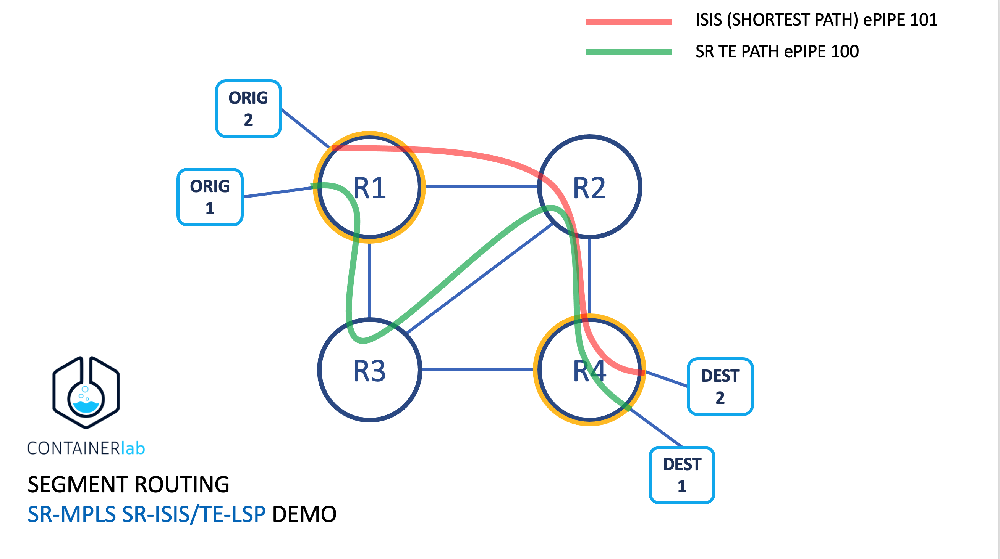

# Segment Routing Lab: SR-MPLS SR-ISIS/TE-LSP Demo

This lab is showing a simple configuration and verification of SR on Nokia’s 7750 routers to signal both IGP’s shortest path and TE LSPs similar to the capabilities of LDP and RSVP-TE MPLS transport label signaling protocols respectively. SR’s built-in capability for Fast ReRoute (FRR) using Loop-Free Alternate (LFA) is also shown

## Network Setup

See topology on the next image


## Requeriments
Versions used are:
* containerlab 0.25.1
* vr-sros 22.5.R2 (requires license)

SROS image was created using [VR Network Lab](https://github.com/vrnetlab/vrnetlab)
IMPORTANT: vr-sos must be set as an image in docker to be pull directly by containerlab
```
# docker images | grep vr-sros
vr-sros                               22.5.R2                         f33cd7a3732a        3 months ago        965MB
```

## Overview
Lab built with containerlab to test sr-mpls using sr-isis.

If you are new with container lab, we recommed to check the post regading [Nokia SROS in the manual](https://containerlab.dev/manual/kinds/vr-sros/)

Details of SR-MPLS, TE-LSP and Fast ReRoute (FRR) capability by pre-computing Loop-Free Alternate (LFA) paths, and other technologies used on this demo, check post: [Segment Routing with Nokia 7750 on GNS3 by Derek Cheung](https://derekcheung.medium.com/segment-routing-b69f6ea2e3f5)

## Setting the lab
Use containerlab a specified topology
```
clab deploy --topo topo.yml
```
Checking elements in the lab
```
# clab inspect --topo topo.yml
INFO[0000] Parsing & checking topology file: topo.yml
+---+--------------------------+--------------+-----------------+---------+---------+----------------+----------------------+
| # |           Name           | Container ID |      Image      |  Kind   |  State  |  IPv4 Address  |     IPv6 Address     |
+---+--------------------------+--------------+-----------------+---------+---------+----------------+----------------------+
| 1 | clab-srmpls-destination1 | 9bd285d5be17 | alpine:latest   | linux   | running | 172.20.20.2/24 | 2001:172:20:20::2/64 |
| 2 | clab-srmpls-destination2 | 18fcb789408e | alpine:latest   | linux   | running | 172.20.20.7/24 | 2001:172:20:20::7/64 |
| 3 | clab-srmpls-origin1      | 0e3edd85ea0b | alpine:latest   | linux   | running | 172.20.20.3/24 | 2001:172:20:20::3/64 |
| 4 | clab-srmpls-origin2      | 08024876191f | alpine:latest   | linux   | running | 172.20.20.5/24 | 2001:172:20:20::5/64 |
| 5 | clab-srmpls-router1      | b1c4368dc299 | vr-sros:22.5.R2 | vr-sros | running | 172.20.20.4/24 | 2001:172:20:20::4/64 |
| 6 | clab-srmpls-router2      | e3583a56107f | vr-sros:22.5.R2 | vr-sros | running | 172.20.20.6/24 | 2001:172:20:20::6/64 |
| 7 | clab-srmpls-router3      | c3fd1648a679 | vr-sros:22.5.R2 | vr-sros | running | 172.20.20.8/24 | 2001:172:20:20::8/64 |
| 8 | clab-srmpls-router4      | 97a35e3939d0 | vr-sros:22.5.R2 | vr-sros | running | 172.20.20.9/24 | 2001:172:20:20::9/64 |
+---+--------------------------+--------------+-----------------+---------+---------+----------------+----------------------+
```

You have direct access (after one min) to management interface via ssh admin/admin
Remember to change the CLI to model-driven if this is still in Classic.
You can copy and paste router settings form yaml files directly to CLI after /configure path
```
A:admin@router4# configure global
INFO: CLI #2054: Entering global configuration mode

[gl:/configure]
A:admin@router4# card 1 {

*[gl:/configure card 1]
A:admin@router4#     card-type iom-v

*[gl:/configure card 1]
A:admin@router4#     mda 1 
## Rest of the lines have been ommitted
```

Optionally, you can set the origin and destination containers as follow:
```
docker exec -i clab-srmpls-origin1 sh -s < origin1_config.sh
docker exec -i clab-srmpls-destination1 sh -s < destination1_config.sh
docker exec -i clab-srmpls-origin2 sh -s < origin2_config.sh
docker exec -i clab-srmpls-destination2 sh -s < destination2_config.sh
```

And test connectivity
```
# docker exec -ti clab-srmpls-origin1 ping 10.10.10.102
PING 10.10.10.102 (10.10.10.102): 56 data bytes
64 bytes from 10.10.10.102: seq=0 ttl=64 time=1.806 ms
64 bytes from 10.10.10.102: seq=1 ttl=64 time=0.860 ms
64 bytes from 10.10.10.102: seq=2 ttl=64 time=0.763 ms
```


## Check status of services

Some commands have been done using <b>Classic command line management interface mode</b>
```
A:router1# show router isis adjacency

===============================================================================
Rtr Base ISIS Instance 0 Adjacency
===============================================================================
System ID                Usage State Hold Interface                     MT-ID
-------------------------------------------------------------------------------
router2                  L2    Up    22   toR2                          0
router3                  L2    Up    20   toR3                          0
-------------------------------------------------------------------------------
Adjacencies : 2
===============================================================================

A:router1# oam lsp-ping sr-isis prefix 1.1.1.4/32
LSP-PING 1.1.1.4/32: 80 bytes MPLS payload
Seq=1, send from intf toR2, reply from 1.1.1.4
       udp-data-len=32 ttl=255 rtt=1.20ms rc=3 (EgressRtr)

---- LSP 1.1.1.4/32 PING Statistics ----
1 packets sent, 1 packets received, 0.00% packet loss
round-trip min = 1.20ms, avg = 1.20ms, max = 1.20ms, stddev = 0.000ms
A:router1# oam lsp-trace sr-isis prefix 1.1.1.4/32
lsp-trace to 1.1.1.4/32: 0 hops min, 0 hops max, 104 byte packets
1  1.1.1.2  rtt=1.69ms rc=8(DSRtrMatchLabel) rsc=1
2  1.1.1.4  rtt=0.734ms rc=3(EgressRtr) rsc=1
```

```
A:admin@router1# show service sdp-using

===============================================================================
SDP Using
===============================================================================
SvcId      SdpId              Type   Far End              Opr   I.Label E.Label
                                                          State
-------------------------------------------------------------------------------
100        4:100              Spok   1.1.1.4              Up    524283  524283
101        5:101              Spok   1.1.1.4              Up    524284  524284
-------------------------------------------------------------------------------
Number of SDPs : 2
-------------------------------------------------------------------------------
===============================================================================

[/]
A:admin@router1# show service sdp

============================================================================
Services: Service Destination Points
============================================================================
SdpId  AdmMTU  OprMTU  Far End          Adm  Opr         Del     LSP   Sig
----------------------------------------------------------------------------
4      0       9182    1.1.1.4          Up   Up          MPLS    T     TLDP
5      0       9190    1.1.1.4          Up   Up          MPLS    I     TLDP
----------------------------------------------------------------------------
Number of SDPs : 2
----------------------------------------------------------------------------
Legend: R = RSVP, L = LDP, B = BGP, M = MPLS-TP, n/a = Not Applicable
        I = SR-ISIS, O = SR-OSPF, T = SR-TE, F = FPE
============================================================================
```

```
*A:router1# oam lsp-trace sr-te "lsp_R1-R4-TE"
lsp-trace to lsp_R1-R4-TE: 0 hops min, 0 hops max, 176 byte packets
1  1.1.1.3  rtt=1.53ms rc=3(EgressRtr) rsc=3
1  1.1.1.3  rtt=1.86ms rc=8(DSRtrMatchLabel) rsc=2
2  1.1.1.2  rtt=1.97ms rc=3(EgressRtr) rsc=2
2  1.1.1.2  rtt=1.50ms rc=8(DSRtrMatchLabel) rsc=1
3  1.1.1.4  rtt=1.25ms rc=3(EgressRtr) rsc=1
```

```
*A:router1# show router fp-tunnel-table 1

===============================================================================
IPv4 Tunnel Table Display

Legend:
label stack is ordered from bottom-most to top-most
B - FRR Backup
===============================================================================
Destination                                  Protocol         Tunnel-ID
  Lbl/SID
    NextHop                                                   Intf/Tunnel
  Lbl/SID (backup)
    NextHop   (backup)
-------------------------------------------------------------------------------
1.1.1.2/32                                   SR-ISIS-0         524290
  519002
    10.1.2.2                                                   1/1/1
  519002
    10.1.3.2(B)                                                1/1/2
1.1.1.3/32                                   SR-ISIS-0         524292
  519003
    10.1.3.2                                                   1/1/2
  519003
    10.1.2.2(B)                                                1/1/1
1.1.1.4/32                                   SR-ISIS-0         524293
  519004
    10.1.2.2                                                   1/1/1
  519004
    10.1.3.2(B)                                                1/1/2
1.1.1.4/32                                   SR-TE             655362
  524285/524287
    10.1.3.2                                                   SR
10.1.2.2/32                                  SR                524289
  3
    10.1.2.2                                                   1/1/1
  519002
    10.1.3.2(B)                                                1/1/2
10.1.3.2/32                                  SR                524291
  3
    10.1.3.2                                                   1/1/2
  519003
    10.1.2.2(B)                                                1/1/1
-------------------------------------------------------------------------------
Total Entries : 6
-------------------------------------------------------------------------------
===============================================================================
````